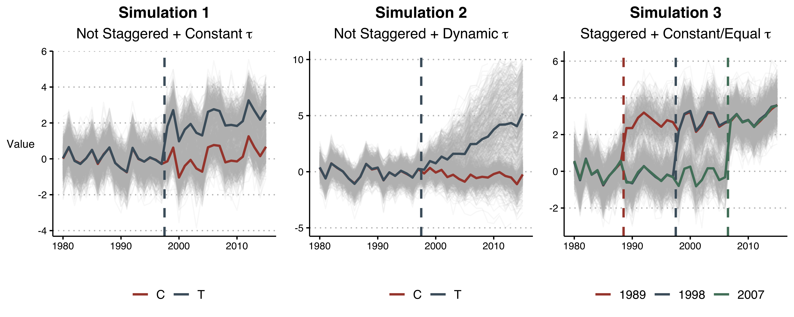

```{css, echo = FALSE}
@media print {
  .has-continuation {
    display: block !important;
  }
}
```
```{r setup, include=FALSE}
knitr::opts_chunk$set(fig.retina = 2)
```
```{r, message = FALSE, warning = FALSE, echo = FALSE}
library(tidyverse)
library(kableExtra)
library(knitr)
library(here)
library(ggthemes)
library(lfe)
library(did)
library(xaringan)
library(patchwork)
library(bacondecomp)
library(multcomp)
library(fastDummies)
library(magrittr)
library(MCPanel)
library(gganimate)
library(gifski)
library(plotly)
library(lubridate)
library(dataverse)
library(RCurl)
library(fixest)
options(knitr.kable.NA = '')

select <- dplyr::select
theme_set(theme_clean() + theme(plot.background = element_blank(),
                                legend.background = element_blank()))
```

# .center.pull[Outline of Talk]

$\hspace{2cm}$

1. Overview of Staggered Difference-in-Differences (DiD)

2. Problems With Fixed Effects Estimation

3. Simulation Analyses

4. Discussion of Alternative Estimation Approaches

5. Replication Example

---

# .center.pull[Use of DiD in Finance and Accounting]

```{r, echo = FALSE, message = FALSE, warning = FALSE, fig.align = 'center', fig.width= 20}
# load the plot already made
knitr::opts_chunk$set(fig.pos = 'H')

```

---

# .center.pull[What Is DiD?]

$\hspace{2cm}$

- Arguably the most basic applied microeconomic causal model.

--

- Simple 2x2 Example:

    - Assume two units and two time periods.
    
--
    
    - $Y_{i, t}^1$ = Value of Y for unit $i$ in period $t$ with treatment.
    
--
    
    - $Y_{i, t}^0$ = Value of Y for unit $i$ in period $t$ without treatment.
    
--

    - With "parallel trends" unbiased estimate of treatment effect is: $$\delta \equiv \mathbb{E}[(Y_{T,1}^1-Y_{T,0}^1)-(Y_{T,1}^0-Y_{T,0}^0)] = \\ \mathbb{E}[(Y_{T,1}^1-Y_{T,0}^1)-(Y_{C,1}^0-Y_{C,0}^0)]$$
    
    
---

# .center.pull[Visual Example]

```{r, echo = FALSE, message = FALSE, warning = FALSE, fig.align = 'center'}
# load the plot already made
knitr::opts_chunk$set(fig.pos = 'H')

```

---

# .center.pull[Regression DiD]

$\hspace{2cm}$

- We don't actually do these manual calculations in practice.

--

- Can get same estimate for $\delta$ from regression:

$$y_{it} = \alpha + \beta_1 TREAT_i + \beta_2 POST_t + \beta_3 (TREAT_i \cdot POST_t) + \epsilon_{it}$$
--

- Most settings have *multiple* units, and *multiple* periods. 

--

- Want to control for differences across units and time periods unrelated to treatment.

--

- Modified regression - the two-way fixed effects (TWFE) DiD estimator:

$$y_{it} = \alpha_i + \lambda_t + \delta^{DD} D_{it} + \epsilon_{it}$$

---

# .center.pull[Bias with TWFE - Goodman-Bacon (2020)]

Main Decomposition:

$$\underset{N \rightarrow \infty}{\text{plim }} \widehat{\delta^{DD}} = \color{green}{VWATT} + \color{blue}{VWCT} -\color{red}{\Delta ATT}$$

--
$\hspace{2cm}$

- $\color{green}{VWATT}$ = variance-weighted average treatment effect on the treated.

--

$\hspace{2cm}$
- $\color{blue}{VWCT}$ = variance-weighted common trend. 

--

$\hspace{2cm}$
- $\color{red}{\Delta ATT}$ = weighted sum of the *change* in treatment effects within each unit's post-period with respect to another unit's treatment timing.

---

# .center.pull[Simulation]

$\hspace{2cm}$

- We simulate datasets similar to those used in corporate finance and accounting applications.
$\hspace{2cm}$

--

- Outcome variable $y_{it}$ in balanced panel with $T = 36$ years from 1980 to 2015, and 1,000 firms $i$.
$\hspace{2cm}$

--

- Time-invariant unit effects and time-varying year effects $\sim N(0, 0.5^2)$.
$\hspace{2cm}$

--

- Firms are headquartered in one of 50 randomly drawn states. These states determine the treatment groups in the simulations.

---

# .center.pull[Where TWFE DiD Works]

```{r, echo = FALSE, message = FALSE, warning = FALSE, fig.align = 'center'}
# load the plot already made
knitr::opts_chunk$set(fig.pos = 'H')

```

---

# .center.pull[Where TWFE DiD Works]

```{r, echo = FALSE, message = FALSE, warning = FALSE, fig.align = 'center'}
# load the plot already made
knitr::opts_chunk$set(fig.pos = 'H')

```

---

# .center.pull[Where TWFE DiD Does Not Work]

```{r, echo = FALSE, message = FALSE, warning = FALSE, fig.align = 'center'}
# load the plot already made
knitr::opts_chunk$set(fig.pos = 'H')

```

---

# .center.pull[Where TWFE DiD Does Not Work]

```{r, echo = FALSE, message = FALSE, warning = FALSE, fig.align = 'center'}
# load the plot already made
knitr::opts_chunk$set(fig.pos = 'H')

```
---
# .center.pull[Decomposition Results]

```{r, echo = FALSE, message = FALSE, warning = FALSE, fig.align = 'center'}
# load the plot already made
knitr::opts_chunk$set(fig.pos = 'H')
knitr::include_graphics("fig3.png", auto_pdf = TRUE)
```

---

# .center.pull[Problematic Comparisons]


```{r, echo = FALSE, message = FALSE, warning = FALSE, fig.align = 'center'}
# load the plot already made
knitr::opts_chunk$set(fig.pos = 'H')
knitr::include_graphics("fig3d.png", auto_pdf = TRUE)
```

---

# .center.pull[Alternative DiD Methods]

```{r, echo = FALSE, message = FALSE, warning = FALSE, fig.align = 'center'}
# load the plot already made
knitr::opts_chunk$set(fig.pos = 'H')
knitr::include_graphics("fig4.png", auto_pdf = TRUE)
```

---

# .center.pull[Big Bad Banks]

- Beck, Levine, Levkov (2010 JF).

$\hspace{2cm}$
--

- Staggered bank branch deregulation across states in 1970s - 1990s.

$\hspace{2cm}$
--

- Authors exploit the cross-state and intertemporal variation in deregulation to analyze impact on income inequality.

$\hspace{2cm}$
--

- Uses CPS data from 1977 - 2007.

---

# .center.pull[Baseline Model]

$$\text{Log(Gini)}_{it} = \alpha_i + \lambda_t + \delta^{DD} D_{it} + \epsilon_{it}$$
$\hspace{2cm}$

```{r, echo = FALSE, message = FALSE, warning = FALSE, fig.align='center'}

read_rds("table3.rds") %>% 
  kable("html", align = 'lcc',
        booktabs = T,
        col.names = c(" ", "Log Gini", "Log Gini"),
        caption = "The Impact of Deregulation on Income Inequality") %>% 
  kable_styling(position = "center", latex_options = "scale_down") %>% 
  add_header_above(c(" " = 1, "No \n Controls" = 1, "With \n Controls" = 1))

```

---

# .center.pull[Goodman-Bacon Decomposition]


```{r, echo = FALSE, message = FALSE, warning = FALSE, fig.align = 'center'}
# load the plot already made
knitr::opts_chunk$set(fig.pos = 'H')
knitr::include_graphics("fig7.png", auto_pdf = TRUE)
```

---

# .center.pull[TWFE Event Study Results]

```{r, echo = FALSE, message = FALSE, warning = FALSE, fig.align = 'center', fig.width = 10, fig.height = 6}
# load data. This is downloaded from https://dataverse.nl/dataset.xhtml?persistentId=hdl:10411/15996.
data <- haven::read_dta(here::here("Reps/BLL/bbb/macro_workfile.dta"))

# make relative year, treatment indicator, and and log gini variables
data <- data %>% 
  mutate(rel_year = wrkyr - branch_reform,
         log_gini = log(gini),
         treat = `_intra`)

# make dummy variables 
data_dummies <- data %>% 
  dummy_cols(select_columns = "rel_year", remove_selected_columns = FALSE,
             ignore_na = TRUE) %>% 
  mutate(across(starts_with("rel_year_"), ~replace_na(., 0))) %>% 
  # bin end points
  mutate(`rel_year_-10` = if_else(rel_year <= -10, 1, 0),
         rel_year_15 = if_else(rel_year >= 15, 1, 0))

# make the formula to estimate
covs <- c(paste0("`", "rel_year_", c(-10:-1, 1:15), "`"))
form <- as.formula(paste0("log_gini ~", paste0(covs, collapse = " + "),
                          "| wrkyr + statefip"))

# estimate model as published
mod8_1 <- feols(form, cluster = "statefip", data = data_dummies)

# plot
broom::tidy(mod8_1, conf.int = TRUE, se = 'cluster') %>%
  # add in the relative time variable
  mutate(t = c(-10:-1, 1:15)) %>% 
  # substract out the the mean for beta -10 to -1
  mutate(conf.low = conf.low - mean(estimate[t < 0]),
         conf.high = conf.high - mean(estimate[t < 0]),
         estimate = estimate - mean(estimate[t < 0])) %>% 
  select(t, estimate, conf.low, conf.high) %>% 
  bind_rows(tibble(t = 0, estimate = 0, conf.low = 0, conf.high = 0)) %>% 
  # make two different periods for the connection
  mutate(group = as.factor(case_when(
    t < 0 ~ 1,
    t >= 0 ~ 2
  ))) %>% 
  # plot
  ggplot(aes(x = t, y = estimate)) + 
  geom_point(fill = "white", shape = 21) + geom_line() + 
  geom_errorbar(aes(ymin = conf.low, ymax = conf.high), 
                linetype = "longdash", show.legend = FALSE) + 
  geom_hline(yintercept = 0,  linetype = "longdash", color = "gray") + 
  geom_vline(xintercept = 0,  linetype = "longdash", color = "gray") + 
  labs(y = "Percent \n Change", x = "Years Relative to Deregulation") + 
  scale_x_continuous(breaks = seq(-10, 15, by = 5)) + 
  scale_y_continuous(breaks = seq(-0.06, 0.04, by = 0.02),
                     label = scales::percent_format(accuracy = 1)) + 
  theme(axis.title.y = element_text(hjust = 0.5, vjust = 0.5, angle = 360, size = 16),
        axis.title.x = element_text(size = 16),
        axis.text = element_text(size = 14))
```

---

# .center.pull[Callaway and Sant'Anna Estimator]
```{r, echo = FALSE, message = FALSE, warning = FALSE, fig.align = 'center'}
# load the plot already made
knitr::opts_chunk$set(fig.pos = 'H')
knitr::include_graphics("fig10.png", auto_pdf = TRUE)
```

---

# .center.pull[Stacked Regression Estimator]
```{r, echo = FALSE, message = FALSE, warning = FALSE, fig.align = 'center'}
# load the plot already made
knitr::opts_chunk$set(fig.pos = 'H')
knitr::include_graphics("fig9.png", auto_pdf = TRUE)
```

---

# .center.pull[Conclusions]

$\hspace{2cm}$

- A ton of papers use staggered DiD estimatio across domain areas in finance, accounting, and the law.

--

- These designs are subjec to potentially severe bias.

--

- The field is advancing in figuring out remedies to this issue.

--

- __But__ there are things we can and should be doing now

--

    - Plot treatment timing.
    
    - Use event study estimators as base DiD analysis.
    
    - With and without covariates.
    
    - Be very cautious with > 2 levels of FE.
    
    - Decompose $\delta^{DD}$ if possible
    
    - Use Pedro's estimator.


